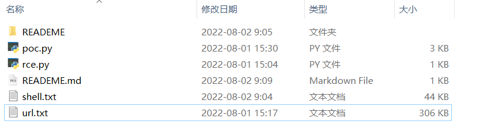
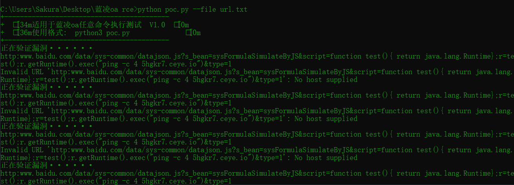
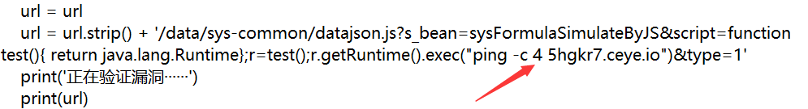

# 蓝凌oa无回显rce漏洞

## 声明

本程序仅供于内部自查使用，请使用者遵守《中华人民共和国网络安全法》，勿将此脚本用于非授权的测试，脚本开发者不负任何连带法律责任。


## 目录列表




## 单个url检测

```python
python3 poc.py --url 单个域名
```


## 批量url检测

```python
python3 poc.py --file url.txt
```


## 效果图



## 说明

url.txt  放入蓝凌oa的ip列表
shell.txt  检测后，脚本会自动把有漏洞的url写进同目录下shell.txt文件
rce.py   经过测试，有些使用python脚本才可以得到返回值。所以如果当您用浏览器访问无法得到返回值时，可以调用python脚本去执行命令  //代理为 127.0.0.1:10808 自己修改代理即可

您可以修改脚本中的命令进行替换